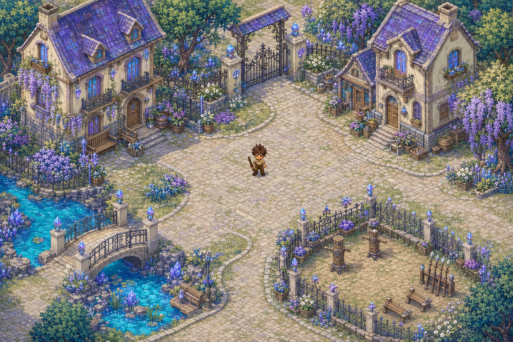
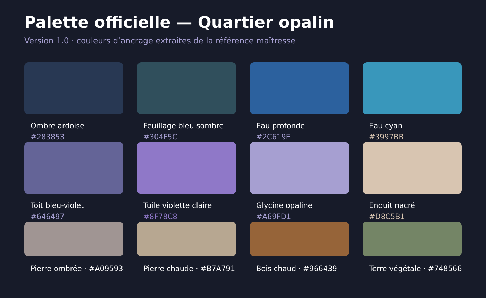

# Nacrelume

**Nacrelume** est un projet de MMO / action-RPG en 2D isométrique, avec exploration par grandes zones continues et combats en temps réel.

> Statut : préproduction. La direction artistique et les principes du monde sont validés ; le moteur, la taille des tuiles et les paramètres de production restent à décider.



## Vision rapide

- vue 2D isométrique / trois-quarts haute ;
- combats en temps réel, jamais au tour par tour ;
- grandes zones ouvertes découpées techniquement en chunks invisibles ;
- cartes prévues dans Tiled (outil recommandé, décision non verrouillée) à partir d’assets séparés ;
- fantasy chaleureuse, florale et opaline ;
- maisons réellement habitées, pierre claire, toits bleu-violet, eau cyan et cristal discret.

## Commencer ici

Humain ou agent IA, lire les documents dans cet ordre avant toute modification :

1. [`AGENTS.md`](AGENTS.md) — règles obligatoires pour contribuer avec une IA ;
2. [`docs/00_START_HERE.md`](docs/00_START_HERE.md) — état actuel et prochain objectif ;
3. [`docs/PROJECT_MEMORY.md`](docs/PROJECT_MEMORY.md) — mémoire consolidée du projet ;
4. [`docs/ART_DIRECTION.md`](docs/ART_DIRECTION.md) — charte visuelle officielle ;
5. [`docs/GAME_DESIGN.md`](docs/GAME_DESIGN.md) — principes de gameplay ;
6. [`docs/WORLD_AND_MAPS.md`](docs/WORLD_AND_MAPS.md) — méthode de création des cartes ;
7. [`docs/TECHNICAL_DECISIONS.md`](docs/TECHNICAL_DECISIONS.md) — décisions prises et questions ouvertes.

## Références visuelles officielles

| Référence | Fichier |
|---|---|
| Personnage de base | [`personnage-base.jpeg`](docs/images/reference/personnage-base.jpeg) |
| Première évolution, quatre couleurs | [`premiere-evolution-4-couleurs.png`](docs/images/reference/premiere-evolution-4-couleurs.png) |
| Quartier opalin | [`quartier-opalin-reference-officielle.png`](docs/images/reference/quartier-opalin-reference-officielle.png) |
| Palette officielle | [`quartier-opalin-palette-officielle.png`](docs/images/reference/quartier-opalin-palette-officielle.png) |
| Prototype régional 3 × 3 | [`prototype-region-3x3.png`](docs/images/maps/prototype-region-3x3.png) |
| Découpage du prototype | [`prototype-region-3x3-grille.png`](docs/images/maps/prototype-region-3x3-grille.png) |



## Source de vérité

Les documents du dépôt priment sur les souvenirs d’une conversation. Une décision importante ne doit jamais être modifiée silencieusement : mettre à jour le document concerné et ajouter une entrée dans [`docs/DECISION_LOG.md`](docs/DECISION_LOG.md).

Les images actuelles sont des **références de direction artistique et de composition**. Elles ne sont pas encore des cartes ou sprites de production directement intégrables au jeu.

## Arborescence documentaire

```text
.
├── AGENTS.md
├── CONTRIBUTING.md
├── README.md
└── docs/
    ├── 00_START_HERE.md
    ├── PROJECT_MEMORY.md
    ├── GAME_DESIGN.md
    ├── ART_DIRECTION.md
    ├── CHARACTER.md
    ├── WORLD_AND_MAPS.md
    ├── TECHNICAL_DECISIONS.md
    ├── ROADMAP.md
    ├── DECISION_LOG.md
    ├── ASSET_CATALOG.md
    ├── AI_HANDOFF.md
    ├── images/
    └── reference/
```
