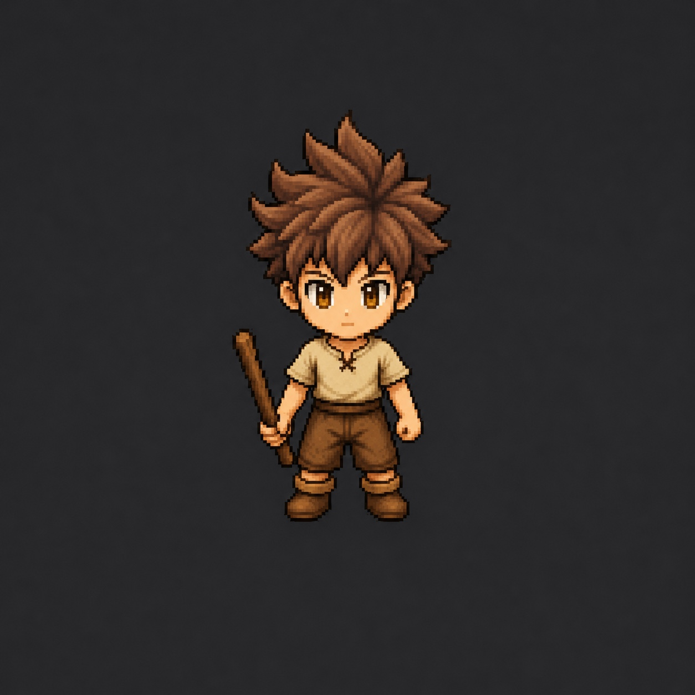

# Personnage officiel

## Forme de base

Caractéristiques à préserver :

- jeune garçon chibi en pixel art ;
- cheveux bruns hérissés ;
- yeux ambrés ;
- tunique beige à manches courtes ;
- bas et bottes bruns ;
- bâton en bois tenu dans la main gauche ;
- proportions, visage et coiffure reconnaissables ;
- aucune aura en forme de base.

## Première évolution

Couleurs retenues :

- rouge ;
- vert ;
- blanc ;
- rose.

Règles de l’effet :

- petite lueur diffuse qui épouse la silhouette ;
- contraste coloré progressif, sans trait dessiné autour du personnage ;
- aucun point lumineux ou particule flottante ;
- pas de flamme gigantesque ;
- transformation volontairement simple, car il s’agit de la première évolution.

## Animation future

Avant de produire les sprites de déplacement, décider :

- nombre de directions : probablement 8 pour une vraie lecture isométrique, à confirmer ;
- nombre d’images par cycle ;
- dimensions et point d’ancrage du sprite ;
- ordre des frames et format de spritesheet ;
- position constante des pieds, de la main et du bâton ;
- synchronisation des auras avec chaque animation.

Une planche d’animation n’est validée que si le personnage conserve la même identité dans toutes les directions.

