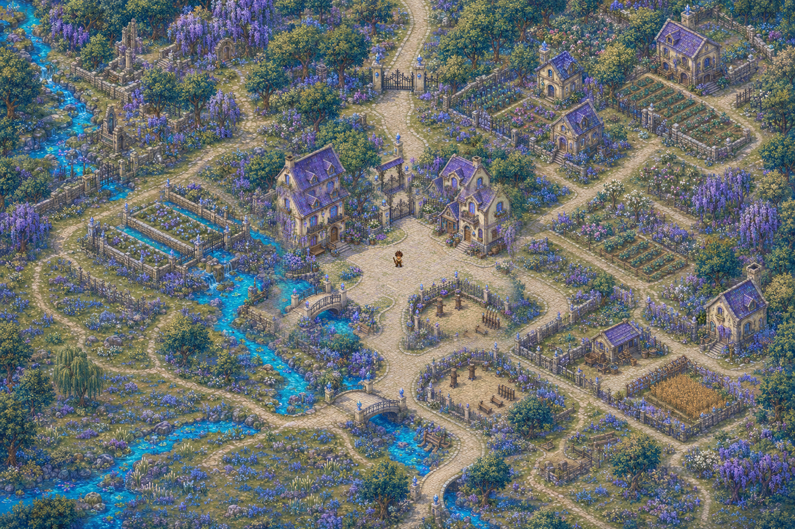
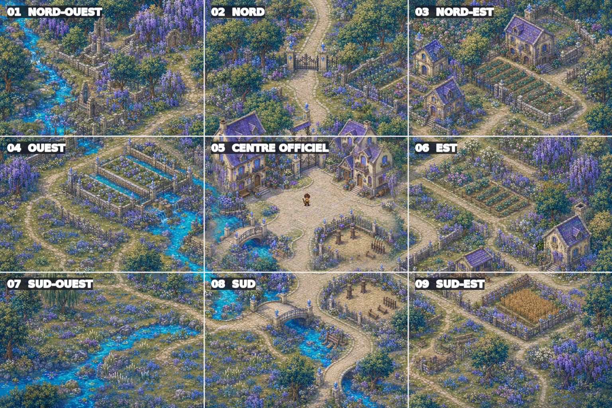

# Monde et cartes

## Architecture du monde retenue

Le monde doit paraître ouvert, mais il n’est pas stocké dans une unique image ou un unique fichier gigantesque.

```text
Monde
└── Région
    ├── Zone continue
    │   ├── Chunk
    │   ├── Chunk
    │   └── Chunk
    └── Instance ou intérieur séparé
```

- **Monde** : ensemble des continents et régions.
- **Région** : identité visuelle et logique géographique cohérente.
- **Zone continue** : espace dans lequel l’exploration et le combat restent fluides.
- **Chunk** : unité technique chargée autour du joueur, invisible dans le gameplay.
- **Instance** : donjon, intérieur ou zone spéciale chargée séparément.

## Méthode obligatoire de création

### 1. Plan régional

Définir avant toute génération détaillée :

- relief et altitudes ;
- rivières et sens d’écoulement ;
- routes principales et secondaires ;
- villes, villages et points d’intérêt ;
- frontières naturelles ;
- biomes et densité de végétation ;
- zones de combat et zones sûres.

### 2. Registre de raccords

Pour chaque bord de chunk, noter :

- coordonnées du chunk ;
- position et largeur des routes ;
- position, largeur et altitude de l’eau ;
- type de sol ;
- murs, barrières ou falaises traversant le bord ;
- objets visibles dans le chunk voisin ;
- direction de lumière et longueur des ombres ;
- identifiants des assets réutilisés.

### 3. Bibliothèque d’assets

Créer des assets réutilisables plutôt que de découper au hasard une grande illustration :

- sols et transitions ;
- routes et bordures ;
- eau, rives et cascades ;
- maisons, toits et éléments occultants ;
- ponts, escaliers et murs ;
- arbres, buissons et fleurs ;
- clôtures et mobilier ;
- éléments de premier plan.

### 4. Construction Tiled

Ordre de calques recommandé :

1. sol de base ;
2. variations de sol ;
3. eau et sous-couches ;
4. routes et transitions ;
5. décor sous le personnage ;
6. bâtiments et obstacles ;
7. collisions ;
8. navigation et coûts de déplacement ;
9. objets occultants / toits ;
10. premier plan ;
11. entités et points d’apparition ;
12. triggers, sorties et zones de gameplay.

## Occlusion

Quand le joueur passe derrière une maison ou un arbre :

- le décor reste devant le joueur grâce au bon ordre de rendu ;
- le toit ou la partie haute peut devenir semi-transparente ;
- une découpe d’occlusion peut masquer uniquement la zone nécessaire ;
- la collision empêche de traverser les volumes solides ;
- la base du bâtiment et son toit doivent être séparables.

Une image de fond unique ne suffit pas à produire ce comportement.

## Prototype 3 × 3





Le prototype valide :

- une rivière traversant plusieurs secteurs ;
- des routes continues ;
- une progression ville → jardins → champs → forêt et prairie humide ;
- une cohérence de palette et de caméra ;
- un découpage réassemblable avec zéro pixel de différence.

Il ne valide pas encore : collisions, navigation, occlusions, échelle réelle des assets, densité des monstres ou performances.

## Première zone de production recommandée

Commencer par une croix de cinq chunks : centre officiel, nord, sud, est et ouest. Les quatre diagonales viennent ensuite.

Cette première zone doit permettre un test complet de déplacement, streaming, collision, poursuite d’un monstre et combat en temps réel.

